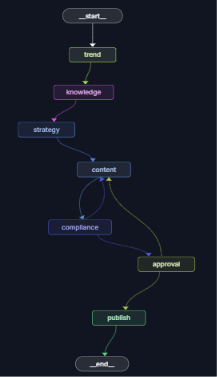
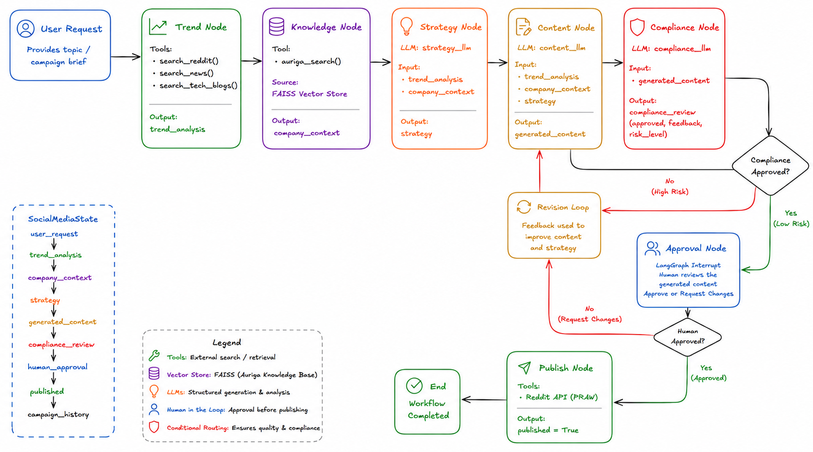

# AI Social Media Content Operations Platform

An AI-powered content operations platform built using **LangGraph**, **LangChain**, **RAG**, **Structured Outputs**, and **Human-in-the-Loop Approval**.

The platform automatically discovers trending AI topics, aligns them with company expertise, generates executive-level thought leadership content, performs compliance checks, and publishes approved content to Reddit.

---

# Overview

Organizations often struggle to convert emerging industry trends into high-quality social media content that is both insightful and aligned with their expertise.

This project automates that workflow by combining:

* Trend Discovery
* Company Knowledge Retrieval
* Content Strategy Generation
* Content Creation
* Compliance Validation
* Human Approval
* Automated Publishing

The workflow is implemented using LangGraph and supports both:

1. Node-Based Architecture
2. Agent-Based Architecture

---

# Features

### Trend Discovery

Discover emerging topics from:

* Reddit
* AI News Sources
* Engineering Blogs

### Retrieval-Augmented Generation (RAG)

Retrieve relevant company knowledge using:

* FAISS Vector Store
* HuggingFace Embeddings
* MMR Retrieval

### Content Strategy Generation

Generate:

* Target Audience
* Key Insight
* Enterprise Challenge
* Future Prediction
* Content Angle
* Call-To-Action

### Executive-Level Content Generation

Generate professional thought leadership content designed for business and technology audiences.

### Compliance Review

Validate generated content for:

* Professional tone
* Technical accuracy
* Misleading claims
* Exaggeration
* Brand consistency

### Human-in-the-Loop Approval

Pause workflow execution using LangGraph Interrupts and require human approval before publishing.

### Reddit Publishing

Publish approved content directly to Reddit.

---

# Architecture

## LangGraph Workflow



## System Architecture



---

# Workflow

## 1. Trend Discovery

The Trend Node gathers information from:

* Reddit discussions
* AI news articles
* Technical blogs

Tools:

```python
search_reddit()
search_news()
search_tech_blogs()
```

Output:

```python
trend_analysis
```

---

## 2. Knowledge Retrieval (RAG)

Relevant company knowledge is retrieved from an internal vector database.

Technologies:

* FAISS
* HuggingFace Embeddings
* MMR Retrieval

Tool:

```python
auriga_search()
```

Output:

```python
company_context
```

---

## 3. Content Strategy Generation

Using:

* Trend Analysis
* Company Knowledge

The workflow creates a structured content strategy.

Output:

```python
strategy
```

---

## 4. Content Generation

Generates executive-level thought leadership content.

Inputs:

* trend_analysis
* company_context
* strategy

Output:

```python
generated_content
```

---

## 5. Compliance Review

Reviews generated content for:

* Professionalism
* Technical correctness
* Brand consistency
* Risk level

Output:

```python
compliance_review
```

---

## 6. Human Approval

Uses LangGraph Interrupts to pause execution and request human approval.

Possible actions:

* Approve
* Request Changes

If changes are requested:

```text
Content → Compliance → Approval
```

loop continues until approved.

---

## 7. Publishing

After approval, content is automatically published to Reddit.

Output:

```python
published = True
```

---

# Supported Architectures

This project supports two workflow implementations.

## Node-Based Workflow (Recommended)

Location:

```text
graph/nodes.py
```

Each stage is implemented as a dedicated LangGraph node.

Benefits:

* Explicit workflow control
* Easier debugging
* Deterministic execution
* Better observability
* Clear state transitions

Workflow:

```text
Trend
 ↓
Knowledge
 ↓
Strategy
 ↓
Content
 ↓
Compliance
 ↓
Approval
 ↓
Publish
```

---

## Agent-Based Workflow

Location:

```text
graph/nodesAgent.py
```

Each stage is implemented using a dedicated AI agent.

Agents:

```text
Trend Agent
Knowledge Agent
Strategy Agent
Content Agent
Compliance Agent
Publish Agent
```

Workflow:

```text
Trend Agent
 ↓
Knowledge Agent
 ↓
Strategy Agent
 ↓
Content Agent
 ↓
Compliance Agent
 ↓
Approval
 ↓
Publish Agent
```

This implementation demonstrates a multi-agent architecture where specialized agents collaborate to generate content.

---

# State Management

The workflow uses a centralized LangGraph state.

```python
class SocialMediaState(TypedDict):
    user_request: str

    trend_analysis: dict

    company_context: str

    strategy: dict

    generated_content: dict

    compliance_review: dict

    human_approval: bool

    published: bool

    campaign_history: list
```

---

# Project Structure

```text
SocialMedia_Agent
│
├── agents/
│   ├── trend_agent.py
│   ├── knowledge_agent.py
│   ├── strategy_agent.py
│   ├── content_agent.py
│   ├── compliance_agent.py
│   └── publish_agent.py
│
├── nodes/
│   ├── trend.py
│   ├── knowledge.py
│   ├── strategy.py
│   ├── content.py
│   └── compliance.py
│
├── graph/
│   ├── graph.py
│   ├── nodes.py
│   ├── nodesAgent.py
│   └── state.py
│
├── notebook/
│   ├── 01_trend_agent.ipynb
│   ├── 02_company_agent.ipynb
│   ├── 03_content_strategy_agent.ipynb
│   ├── 04_content_generation_agent.ipynb
│   ├── 05_brand_compliance_agent.ipynb
│   └── 06_langgraph_workflow.ipynb
│
├── vectorstore/
│   └── auriga/
│
├── images/
│
├── app.py
├── config.py
├── langgraph.json
├── requirements.txt
└── README.md
```

---

# Directory Explanation

## agents/

Contains the original multi-agent implementation.

Each file defines a specialized AI agent responsible for a specific stage of the workflow.

## nodes/

Contains tools, structured output schemas, retrieval logic, and reusable components used by the node-based workflow.

## graph/nodes.py

Node-based workflow implementation.

Each workflow stage is represented as a dedicated LangGraph node.

## graph/nodesAgent.py

Agent-based workflow implementation.

Each stage invokes a specialized AI agent.

## graph/graph.py

Defines:

* LangGraph workflow
* Routing logic
* Conditional edges
* Human approval flow
* Publishing flow

## graph/state.py

Defines the shared workflow state.

## vectorstore/

Contains the FAISS knowledge base built from Auriga company information.

## notebook/

Development notebooks used while building and testing each stage independently.

## config.py

Initializes:

* Gemini 2.5 Flash
* Groq Llama 3.3 70B
* Environment variables
* API keys

## app.py

Application entry point.

## langgraph.json

Configuration file used by:

```bash
langgraph dev
```

to visualize and test workflows in LangGraph Studio.

---

# Running the Project

Install dependencies:

```bash
pip install -r requirements.txt
```

Run locally:

```bash
python app.py
```

Launch LangGraph Studio:

```bash
langgraph dev
```

---

# Tech Stack

## AI Frameworks

* LangGraph
* LangChain

## Models

* Gemini 2.5 Flash
* Llama 3.3 70B (Groq)

## Retrieval

* FAISS
* HuggingFace Embeddings
* MMR Search

## Data Sources

* Tavily Search
* Reddit
* AI News
* Technical Blogs

## Publishing

* Reddit API (PRAW)

---

# Example Request

```text
Create a thought-leadership post about Agentic AI adoption in enterprises.
```

---

# Future Improvements

* LinkedIn Publishing
* Multi-Platform Publishing
* Campaign Analytics
* Engagement Tracking
* Scheduled Publishing
* Multi-Company Knowledge Bases
* Campaign Memory
* Historical Performance Analysis

---

# Key Learnings

This project demonstrates:

* LangGraph Workflow Orchestration
* Multi-Agent Systems
* Human-in-the-Loop AI
* Retrieval-Augmented Generation (RAG)
* Structured Outputs
* Tool Calling
* Conditional Routing
* State Management
* AI Content Operations
* Enterprise Content Governance

```
```
